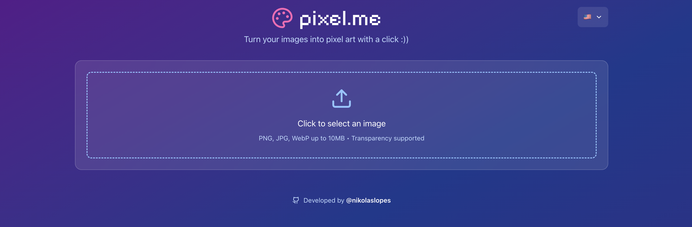
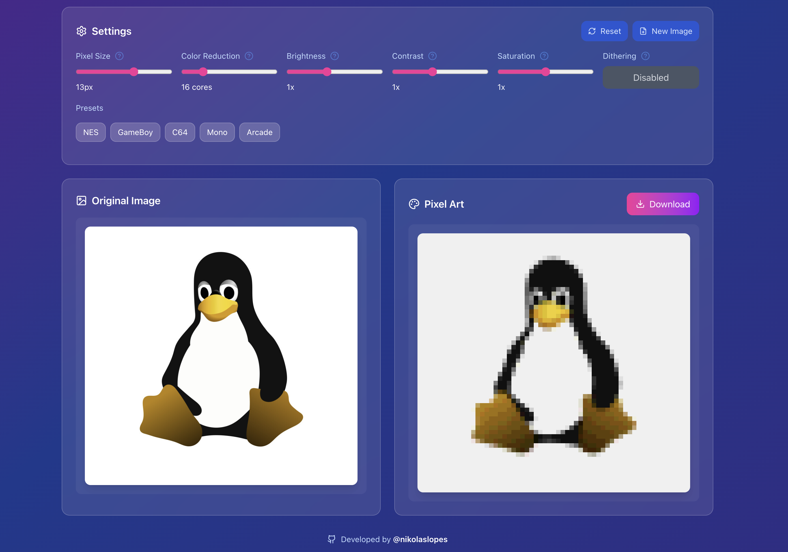
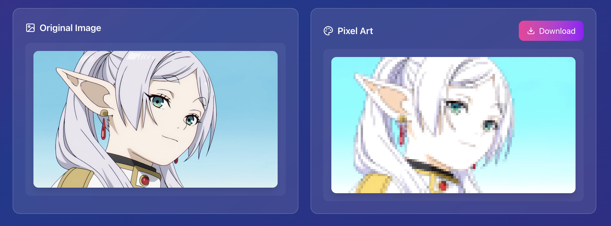

<div align="center">
 
</div>

---

🟢 [Live Demo](https://pixelme-pi.vercel.app/home)

### 📖 About the Project

The **pixel.me** is a web application to transform images into pixel art, that's all :D. The main idea is to use pure JavaScript to generate the image.

### ✨ Key Features

- Generate pixel art images: Simply select or drag an image to preview it.
- Image presets: Default presets based on old school pixel art
- Optimized performance: Developed with Next.js for fast loading and smooth navigation.
- Responsive: Works perfectly on desktops, tablets, and mobile devices.
- Multi-language Support: Available in 🇬🇧 English, 🇧🇷 Brazilian Portuguese, 🇯🇵 Japanese, 🇪🇸 Spanish, 🇫🇷 French, and 🇩🇪 German.

### 🖼️ Screenshots

<p align="center">
  
  
  
</p>

### ⚙️ Getting Started Locally

To get started with this project on your local machine, follow the steps below.

**Prerequisites**

- **Node.js:** This project requires a specific version of Node.js to run correctly, which is specified in the `.nvmrc` file.
  - If you use NVM (Node Version Manager), simply run nvm use in the project's root directory to automatically switch to the correct version.
  - If you don't use NVM, please ensure your Node.js version is v24.4.1 or a compatible version.
- **Package Manager:** A package manager like npm, yarn, pnpm, or bun.

#### Installation and Running

1. **Clone the repository:**

```bash
git clone https://github.com/nikolaslopes/pixel.me.git
```

2. **Navigate to the project directory:**

```bash
cd pixel.me
```

3. **Install the dependencies:**

```bash
npm install
# or
yarn install
# or
pnpm install
```

4. **Run the development server:**

```bash
npm run dev
# or
yarn dev
# or
pnpm dev
```

5. **Open your browser:**
   Access http://localhost:3000 to see the result

### 🤝 Contributing & Suggestions

This is a project under development, and bugs may occur. If you find any issues or have suggestions to improve **pixel.me**, please feel free to open an **[Issue](https://github.com/nikolaslopes/pixel.me/issues)**!

All contributions are welcome.

---

<p align="center">👾 Developed by <a href="https://github.com/nikolaslopes" target="_blank">@nikolaslopes</a><div>
